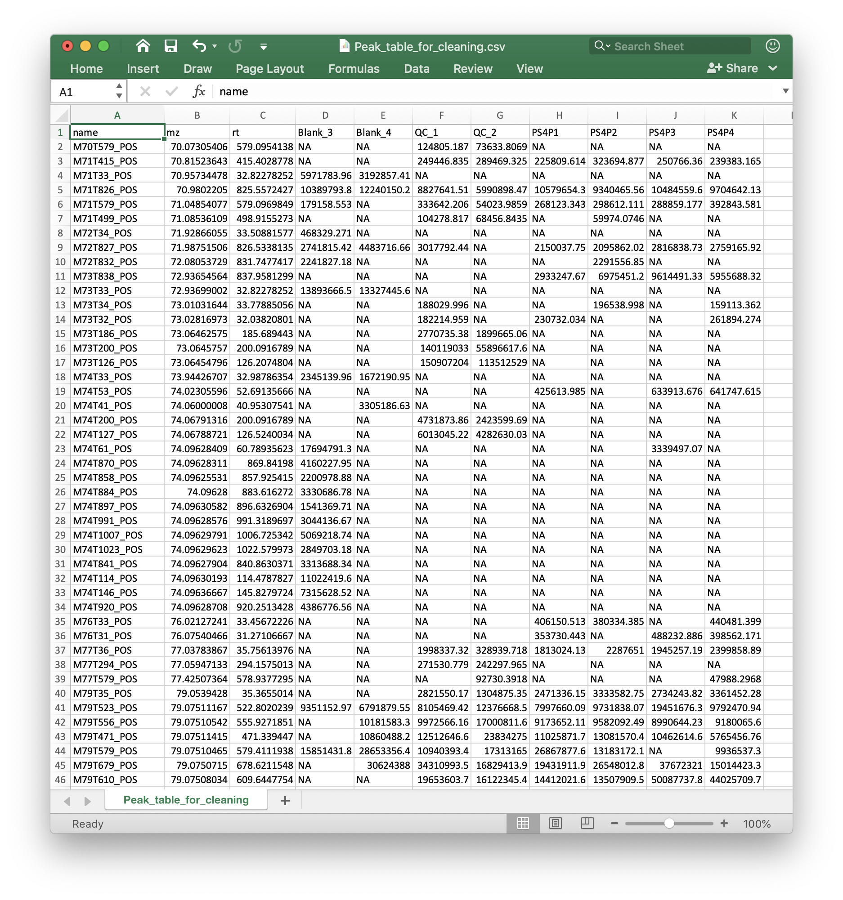

```{r, include = FALSE, echo=FALSE}
knitr::opts_chunk$set(
  collapse = TRUE,
  comment = "#>",
  # fig.width = 7, 
  # fig.height = 5,
  warning = FALSE,
  message = TRUE,
  out.width = "100%"
)
```

We can use `metflow2` for data normalization and data integration.

First, we need to prepare samples for `metflow2`.

## **Data preparation**

### **Peak table**

The peak table (csv format) can be from any software. We recomment that you use the `Peak_table_for_cleaning.csv` from `processData()` function from `metflow2`.

If you use other software, please make sure that the top 3 columns are `name` (peak name), `mz` and `rt` (rentention time, second). And the left column are sample intensity.



### **Sample information**

We need the sample information (csv format) to define the detailed information of samples. Column 1 is `sample.name`, column 2 is `injection.order`, column 3 is `class` (such as Subject, QC, Blank), column 4 is `batch` and column 5 is `group` (such as control and case).


## **Read data**

Then place the peak table and sample information in a folder. We use the demo data from `demoData` package.

```{r,eval=TRUE,warning=FALSE, R.options="", message=FALSE, cache=FALSE}
library(metflow2)
library(demoData)
```

### **Load demo data**

```{r,eval=TRUE,warning=FALSE, R.options="", message=FALSE,cache = TRUE}
##creat a folder nameed as example
path <- file.path(".", "example")
dir.create(path = path, showWarnings = FALSE)
```

```{r,eval=TRUE,warning=FALSE, R.options="", message=FALSE, cache=TRUE}
##get demo data
demo_data <- system.file("metflow2", package = "demoData")

file.copy(from = file.path(demo_data, dir(demo_data)), 
          to = path, overwrite = TRUE, recursive = TRUE)
```

Here, we have two peak tables, `batch1.data.csv` and `batch2.data.csv`, and `sample_info.csv` are in your `./example` folder.

### **Creat `metflowClass` object**

```{r,eval=TRUE,warning=FALSE, R.options="", message=FALSE, cache=TRUE}
object <- creatMetflowObject(ms1.data = c("batch1.data.csv", "batch2.data.csv"),
                             sample.information = "sample_info.csv",
                             path = path)
```

`object` is a `metflowClass` object, so you can print it in the console.


## **Align different batches**

Because there are two batch peak tables, so first we must align them.

```{r,eval=TRUE,warning=FALSE, R.options="", message=FALSE, cache=TRUE}
object <- align_batch(
  object = object,
  combine.mz.tol = 15,
  combine.rt.tol = 30,
  use.int.tol = FALSE
)
```

## **Missing value processing**

### **Remove noisy peaks and outlier samples**

```{r,eval=TRUE,warning=FALSE, R.options="", message=FALSE, cache=TRUE}
object2 <- filter_peaks(
  object = object,
  min.fraction = 0.5,
  type = "any",
  min.subject.blank.ratio = 2,
  according.to = "class",
  which.group = "QC"
)
```

### **Remove outlier samples**

Nest, we should remove some samples which have a lot of missing values.

```{r,eval=TRUE,warning=FALSE, R.options="", message=FALSE, cache=TRUE}
object2 <- filter_samples(object = object2,
                          min.fraction.peak = 0.9)
```

### **Missing value imputation**

```{r,eval=TRUE,warning=FALSE, R.options="", message=FALSE, cache=TRUE}
object2 <- imputeMV(object = object2,
                    method = "knn")
object2
```

## **Data normalization**

Now we can normalize data using different methods.

```{r,eval=TRUE,warning=FALSE, R.options="", message=FALSE, cache=TRUE}
object3 <- normalizeData(object = object2, method = "mean")
```

```{r,eval=TRUE,warning=FALSE, R.options="", message=FALSE, cache=TRUE}
object3 <- normalizeData(object = object2, method = "svr")
```

```{r,eval=TRUE,warning=FALSE, R.options="", message=FALSE, cache=TRUE}
# object3 <- normalizeData(object = object2, method = "pqn")
```


