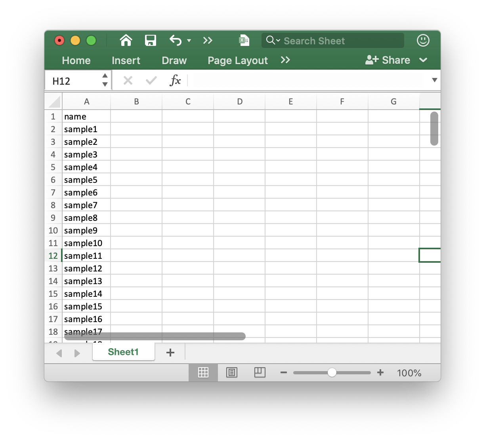
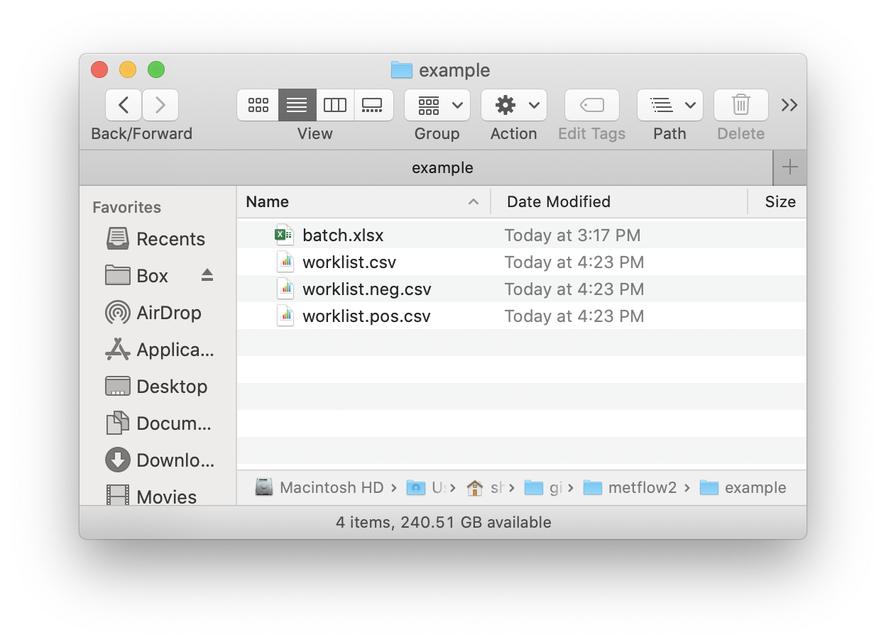

```{r, include = FALSE, echo=FALSE}
knitr::opts_chunk$set(
  collapse = TRUE,
  comment = "#>",
  # fig.width = 7, 
  # fig.height = 5,
  warning = FALSE,
  message = TRUE,
  out.width = "100%"
)
```

`metflow2` also provide some other useful tools.

***

## **Metabolite ID convert**

> **Note**: This function has been deprecated, try to new function in [`tinyTools` package](https://jaspershen.github.io/tinyTools/).

`transID()` function can be used to convert metabolites in more than 225 databases. It is based on the http://cts.fiehnlab.ucdavis.edu/ and https://www.chemspider.com/InChI.asmx.

### Convert chemical ID based on http://cts.fiehnlab.ucdavis.edu/

You can use the `databaseName()` function to get the databases supported in `transID()`.

```{r,eval=TRUE,warning=FALSE, R.options="", message=TRUE, cache=FALSE}
library(metflow2)
library(tidyverse)
```

```{r,eval=TRUE,warning=FALSE, R.options="", message=TRUE, cache=FALSE, error=TRUE}
database <- metflow2::databaseName(server = "http://cts.fiehnlab.ucdavis.edu/service/convert")
database$From
database$To
```

Then you can convert ID using `transID()` function.

```{r,eval=TRUE,warning=FALSE, R.options="", message=FALSE, cache=FALSE, error=TRUE}
transID(query = "C00001", from = "KEGG", 
        to = "PubChem SID", top = 2,
        server = "http://cts.fiehnlab.ucdavis.edu/service/convert")
```

The `from` and `to` argument must be from `databaseName()` function.

```{r,eval=TRUE,warning=FALSE, R.options="", message=FALSE, cache=TRUE, error=TRUE}
transID(query = "C00001", from = "KEGG", 
        to = "Human Metabolome Database", top = 2,
        server = "http://cts.fiehnlab.ucdavis.edu/service/convert")
```

### Convert chemical ID based on https://www.chemspider.com/InChI.asmx

Another databsae https://www.chemspider.com/InChI.asmx also support ID conveter. First please use `databaseName()` to know which databases are supported in this website.

```{r,eval=TRUE,warning=FALSE, R.options="", message=FALSE, cache=TRUE, error=TRUE}
database <- databaseName(server = "https://www.chemspider.com/InChI.asmx")
database
```

Here we first use the http://cts.fiehnlab.ucdavis.edu/service/convert convert C00001 to get it's InChIKey ID.

```{r,eval=TRUE,warning=FALSE, R.options="", message=FALSE, cache=TRUE, error=TRUE}
transID(query = "C00010", 
        from = "KEGG", 
        to = "InChIKey", 
        top = 1,
        server = "http://cts.fiehnlab.ucdavis.edu/service/convert")
```

Then we use InChIKey ID to get its smiles.

```{r,eval=TRUE,warning=FALSE, R.options="", message=FALSE, cache=TRUE, error=TRUE}
inchi <- 
transID(query = "RGJOEKWQDUBAIZ-IBOSZNHHSA-N", 
        from = "inchikey", 
        to = "inchi",
        top = 2,
        server = "https://www.chemspider.com/InChI.asmx")
inchi
```

```{r,eval=TRUE,warning=FALSE, R.options="", message=FALSE, cache=TRUE, error=TRUE}
smiles <- 
transID(query = inchi,
        from = "inchi", 
        to = "smiles",
        top = 2,
        server = "https://www.chemspider.com/InChI.asmx")
smiles
```

## **Get metabolite class**

> **Note**: This function has been deprecated, try to new function in [`tinyTools` package](https://jaspershen.github.io/tinyTools/).

We can use `get_metclass()` function to get the metabolite class based on `classyfire`.

We need the `inchikey` for `get_metclass()` function, so if we don't have the `inchikey`, we can use the `transID()` function to get their `inchikey`.

```{r,eval=TRUE,warning=FALSE, R.options="", message=FALSE, cache=FALSE, error=TRUE}
library(metflow2)
```

```{r,eval=TRUE,warning=FALSE, R.options="", message=FALSE, cache=FALSE, error=TRUE}
inchikey <- 
transID(query = "C00001", 
        from = "KEGG", 
        to = "InChIKey", 
        top = 1,
        server = "http://cts.fiehnlab.ucdavis.edu/service/convert")
inchikey <- inchikey$InChIKey
inchikey
```

```{r,eval=TRUE,warning=FALSE, R.options="", message=FALSE, cache=FALSE, error=TRUE}
class <- get_metclass(inchikey = inchikey)
```

`class` is a `classfire` class. 

```{r,eval=TRUE,warning=FALSE, R.options="", message=FALSE, cache=FALSE, error=TRUE}
class
```

```{r,eval=TRUE,warning=FALSE, R.options="", message=FALSE, cache=FALSE, error=TRUE}
class@compound_info
```

```{r,eval=TRUE,warning=FALSE, R.options="", message=FALSE, cache=FALSE, error=TRUE}
class@taxonomy_tree
```

```{r,eval=TRUE,warning=FALSE, R.options="", message=FALSE, cache=FALSE, error=TRUE}
class@classification_info
```

```{r,eval=TRUE,warning=FALSE, R.options="", message=FALSE, cache=FALSE, error=TRUE}
class@description
```

```{r,eval=TRUE,warning=FALSE, R.options="", message=FALSE, cache=FALSE, error=TRUE}
class@external_descriptors
```


## **Generate running list**

We can use the `getWorklist()` function in `metflow2` to generate a working list.

First, we should creat a `batch.xlsx` and put it in a folder. We use the demo data in `demoData` package.

The `batch.xlsx` is like this:



```{r,eval=TRUE,warning=FALSE, R.options="", message=FALSE, cache=FALSE, error=TRUE}
library(metflow2)
library(demoData)
```

```{r,eval=TRUE,warning=FALSE, R.options="", message=FALSE, cache=FALSE, error=TRUE}
##creat a folder nameed as example
path <- file.path(".", "example")
dir.create(path = path, showWarnings = FALSE)
```

```{r,eval=TRUE,warning=FALSE, R.options="", message=FALSE, cache=TRUE, error=TRUE}
##get demo data
demo_data <- system.file("metflow2", package = "demoData")

file.copy(from = file.path(demo_data, "batch.xlsx"), 
          to = path, overwrite = TRUE, recursive = TRUE)
```

Next, run the `getWorklist()` function.

```{r,eval=TRUE,warning=FALSE, R.options="", message=FALSE, cache=TRUE, error=TRUE}
getWorklist(
  table.name = "batch.xlsx",
  instrument = c("Thermo", "Agilent", "AB"),
  each.mode.number = 32,
  randommethod = c("no", "position", "injection"),
  samplenumber = NULL,
  QCstep = 8,
  conditionQCnumber = 8,
  qc.index.from = 1,
  dir = "D:\\Liang\\data\\PS4U\\HILIC\\batch3\\",
  method.path = "D:\\Liang\\Method\\urine\\HILIC\\",
  ms1.method.pos = "ZIC-HILIC_MS_pos",
  ms1.method.neg = "ZIC-HILIC_MS_neg",
  ms2.method.pos = c(
    "ZIC-HILIC_MSMS_pos_NCE25",
    "ZIC-HILIC_MSMS_pos_NCE25",
    "ZIC-HILIC_MSMS_pos_NCE25",
    "ZIC-HILIC_MSMS_pos_NCE25"
  ),
  ms2.method.neg = c(
    "ZIC-HILIC_MSMS_neg_NCE25",
    "ZIC-HILIC_MSMS_neg_NCE25",
    "ZIC-HILIC_MSMS_neg_NCE25",
    "ZIC-HILIC_MSMS_neg_NCE25"
  ),
  path = path
)
```

Then, the worklists will generated in this folder.




