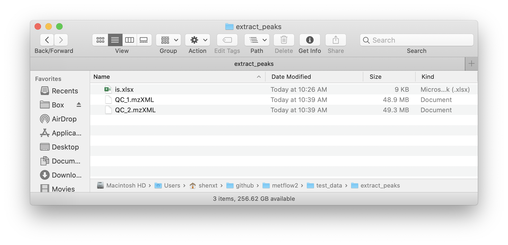
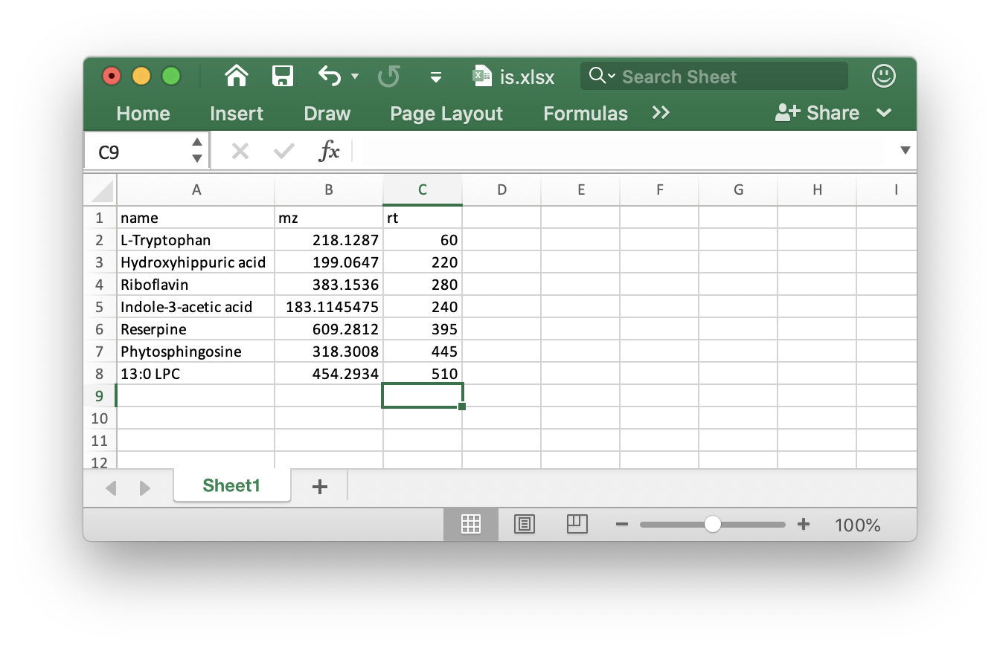
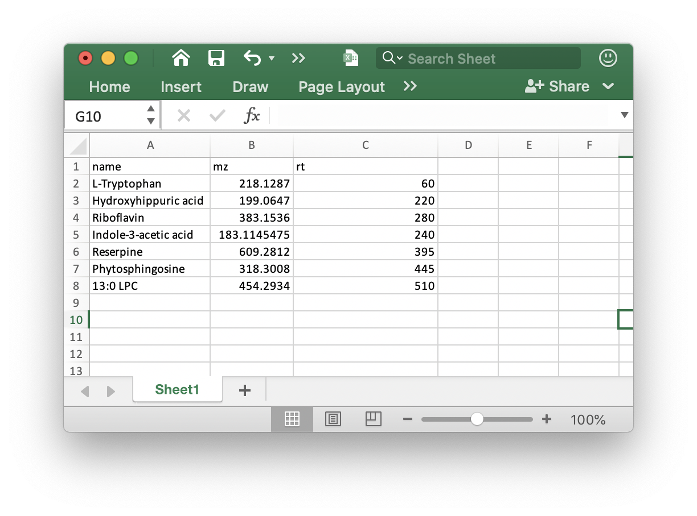

```{r, include = FALSE, echo=FALSE}
knitr::opts_chunk$set(
  collapse = TRUE,
  comment = "#>",
  # fig.width = 7, 
  # fig.height = 5,
  warning = FALSE,
  message = TRUE,
  out.width = "100%"
)
```

`metflow2` also provide some useful tools for MS raw data processing.

***

## **Extract EICs from mzXML data**

You can use `metflow2` to extract peaks from the mzXML format data and then draw them.

### **Data preparation**

Put you mzXML data and the `feature_table` (xlsx format) in a folder and then set this folder as the working directory.



The `feature_table` should be xlsx format and like the below figure shows:



> Note: The rt must in seconds.

We use the demo data from `demoData` package.

### **Load demo data**

First we load the demo data from `demoData` package and then place them in a `example` folder.

```{r,eval=TRUE,warning=FALSE, R.options="", message=TRUE}
library(demoData)
library(metflow2)
library(tidyverse)
```

```{r,eval=TRUE,warning=FALSE, R.options="", message=FALSE}
##creat a folder nameed as example
path <- file.path(".", "example")
dir.create(path = path, showWarnings = FALSE)
```

```{r,eval=FALSE,warning=FALSE, R.options="", message=FALSE}
##get demo data
mzxml_data <- system.file("mzxml/POS/QC", package = "demoData")

file.copy(from = file.path(mzxml_data, dir(mzxml_data)), 
          to = path, overwrite = TRUE, 
          recursive = TRUE)

is_table <- system.file("mzxml/POS/", package = "demoData")

file.copy(from = file.path(is_table, "is.xlsx"), 
          to = path, overwrite = TRUE, 
          recursive = TRUE)
```

Now the demo mzXML data and feature table (`is.xlsx`)is in the `./example/` folder. 

### **Extract peaks**

Next, we use the `extractPeaks()` function for peak detection and alignment.

```{r,eval = TRUE, warning=FALSE, message=FALSE,R.options="",cache=TRUE, message=FALSE}
peak_data <- 
extractPeaks(
  path = path,
  ppm = 15,
  threads = 4,
  is.table = "is.xlsx",
  mz = NULL,
  rt = NULL,
  rt.tolerance = 40
)
```

Some important arguments:

* `ppm`: Peak detection ppm. 

* `rt.tolerance`: Peak detection ppm. 

* `is.table`: If you add internal standards in your samples, you can provide the the `is.table` in the folder which your mzXML format data in. It must be `xlsx` format like the below figure shows:



Other parameters you can find here: `processData()`.

### **Draw plots**

After get the `peak_data` using `extractPeaks()` function, we can use `showPeaks()` function to draw plot.

```{r,eval = TRUE,warning=FALSE, message=FALSE,R.options="",cache=TRUE, message=FALSE}
showPeak(object = peak_data, peak.index = 1)
```

If you don't want to get the interactive plot, you can just set `interactive` as `FALSE`.

```{r,eval = TRUE,warning=FALSE, message=FALSE,R.options="",cache=TRUE, message=FALSE}
showPeak(object = peak_data, peak.index = 1, interactive = FALSE)
```

You can also set `alpha` as 0 to avoid the area color.

```{r,eval = TRUE,warning=FALSE, message=FALSE,R.options="",cache=TRUE, message=FALSE}
showPeak(object = peak_data, peak.index = 5, alpha = 0)
```
