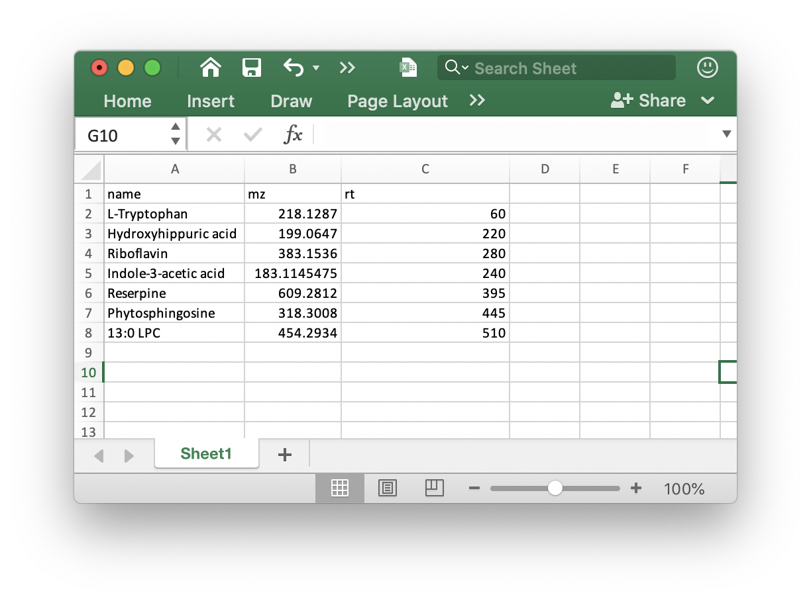

```{r, include = FALSE, echo=FALSE}
knitr::opts_chunk$set(
  collapse = TRUE,
  comment = "#>",
  # fig.width = 7, 
  # fig.height = 5,
  warning = FALSE,
  message = TRUE,
  out.width = "100%"
)
```

***

## **Introduction**

*metflow2* can used to processed the raw MS data for peak detection and alignment, and generate a peak table for next analysis. 

## **Data preparation**

The MS raw data from Mass Spectrometry should be converted to `mzXML` format and then placed in different folders according to their class, for example `Subject`, `QC`, and `Blank` samples.

Here we use the demo data from `demoData` packages. So please install `demoData` package first.

```{r,eval=FALSE,warning=FALSE, R.options=""}
devtools::install_github("jaspershen/demoData")
```

You can convert raw MS data to mzXML format using [`ProteoWizard` software](http://proteowizard.sourceforge.net/). And the parameter setting is shown the below figure:


## **Data organization**

All the `mzXML` format files should be placed in different folder according to sample type, such as `QC`, `Subject`, and `Blank`. 

!()[../man/figures/Screen Shot 2020-04-01 at 10.31.27 AM.png]

## **Run `processData()`** function

We use the demo data from `demoData` to show how to process raw MS data using `metflow2`.

### **Load demo data**

First we load the demo data from `demoData` package and then place them in a `example` folder.

```{r,eval=FALSE,warning=FALSE, R.options="", message=FALSE}
library(demoData)
library(metflow2)
library(tidyverse)
```

```{r,eval=FALSE,warning=FALSE, R.options="", message=FALSE,cache = TRUE}
##creat a folder nameed as example
path <- file.path(".", "example")
dir.create(path = path, showWarnings = FALSE)
```

```{r,eval=FALSE,warning=FALSE, R.options="", message=FALSE, cache=TRUE}
##get demo data
mzxml_data <- system.file("mzxml", package = "demoData")

file.copy(from = file.path(mzxml_data, "POS"), 
          to = path, overwrite = TRUE, recursive = TRUE)
```

Now the demo mzXML data is in the `./example/POS` folder. There are two folder in this directory, namely `Subject` and `QC`.


### **Data processing**

Next, we use the `processData()` function for peak detection and alignment.


```{r,eval = FALSE,warning=FALSE, message=FALSE,R.options="",cache=TRUE, message=FALSE}
new_path <- file.path(path, "POS")
metflow2::processData(
  path = ".",
  polarity = "positive",
  ppm = 15,
  peakwidth = c(5, 30),
  snthresh = 5,
  noise = 500,
  threads = 6,
  output.tic = TRUE,
  output.bpc = TRUE,
  output.rt.correction.plot = TRUE,
  min.fraction = 0.5,
  fill.peaks = FALSE,
  is.table = "is.table.xlsx",
  group.for.figure = "QC"
)
```

Some important arguments:

* `ppm`: Peak detection ppm. See the `xcms` package.

* `peakwidth`: Peak width. It is dependent on your column and LC system. See the `xcms` package.

* `snthresh`: Singal to noise threshold. See the `xcms` package.

* `noise`: Noise cutiff. See the `xcms` package.

* `threads`: The core number for performing.

* `output.tic`, `output.bpc`, and `group.for.figure`: Do you want to output the TIC or BPC of samples? Some times there are a lot of samples, so you can set the `group.for.figure` as the group name, for example, you can set it as `QC`. 

* `min.fraction`: If one peak appears more than `min.fraction` sample in at least one group samples it will be kept.

* `fill.peaks`: Do you want to fill the missing values (NA)? 

* `is.table`: If you add internal standards in your samples, you can provide the the `is.table` in the folder which your mzXML format data in. It must be `xlsx` format like the below figure shows:



Ohter parameters you can find here: `processData()`.

## **Output results**

After all done, all the results are placed in a new folder named as `Result`.


* `Peak_table.csv`: is the peak table for next analysis.


* `Peak_table_for_cleaning.csv`: Some non-useful columns is deleted from the `Peak_table.csv`, this can be directory used for next data cleaning.


* `intermediate_data`: This is a folder which contains some intermediate data. If you want to re-run the data processing, please delete this folder first.

* `feature_EIC`: If you provide the internal standard table, the EICs of all the ISs will be placed in this folder.


From the EICs of the internal standards, you can access the quality of data.

